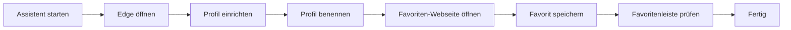

# DOKUMENTATION_ANWENDER

**Projekt:** Edge Profil-Assistent  
**Stand:** 21.06.2026

## Zweck

Der **Edge Profil-Assistent** unterstützt Anwender:innen dabei, ein neues Microsoft-Edge-Profil einzurichten und den benötigten Favoriten strukturiert anzulegen.

Die Anwendung läuft als portable Single-EXE und führt Schritt für Schritt durch den Ablauf.

## Zielgruppe

- Mitarbeitende, die ein neues Edge-Profil einrichten
- Trainer:innen/Support für Erstinbetriebnahme
- IT-nahe Anwender:innen für standardisierte Rollouts

## Schnellstart

1. Die versionierte EXE aus `release/` starten.
2. Assistent links auf dem Bildschirm verwenden.
3. Microsoft Edge wird bei Bedarf rechts geöffnet und positioniert.
4. Schritte im Assistenten nacheinander abarbeiten.

## Ablauf auf einen Blick

## Bedienung

### Navigation

- **Weiter / Edge öffnen / Webseite öffnen / Schließen**: führt den aktuellen Schritt aus
- **Zurück**: springt zum vorherigen Schritt
- **Abbrechen**: beendet den Assistenten

### Fortschritt

Unten werden zwei Fortschrittsanzeigen dargestellt:

- **Textanzeige**: `Schritt X von Y`
- **Kreisanzeige mit Nummern** (unten rechts):
  - aktueller Schritt = hervorgehoben
  - bereits absolvierte Schritte = gedämpft markiert
  - kommende Schritte = grau

## Inhalte der Assistenten-Schritte

1. **Willkommen**
2. **Microsoft Edge öffnen**
3. **Profil einrichten**
4. **Profil benennen**
5. **Favoriten-Webseite öffnen**
6. **Favorit speichern**
7. **Favoritenleiste prüfen**
8. **Fertig**

## Hinweise zur Anzeige

- Der Assistent positioniert sich auf der linken Bildschirmhälfte.
- Edge wird (wenn möglich) auf der rechten Hälfte geöffnet.
- Optionale Screenshots werden im jeweiligen Schritt eingeblendet.

## Häufige Fragen (FAQ)

**Muss ich etwas installieren?**  
Nein. Die EXE ist portable und kann direkt ausgeführt werden.

**Brauche ich Administratorrechte?**  
In der Regel nicht. Der Assistent arbeitet im Benutzerkontext.

**Was passiert bei fehlenden optionalen Screenshots?**  
Der Assistent läuft trotzdem. Der Bildbereich bleibt im jeweiligen Schritt ausgeblendet.

**Wo liegen temporäre Laufzeitdaten?**  
Unter `%LOCALAPPDATA%\Temp\EdgeSetupAssistent\run-<PID>`.

## Fehlersuche (Kurz)

- **EXE startet nicht**: Datei aus `release/` erneut kopieren oder Build neu ausführen.
- **Edge wird nicht gefunden**: Edge-Installation prüfen, dann erneut starten.
- **Fensterpositionierung stimmt nicht**: Mehrschirm-Setup prüfen, Edge ggf. manuell anordnen.

## Weiterführende Dokumente

- `docs/DOKUMENTATION_TECHNIK.md`
- `README.md`
