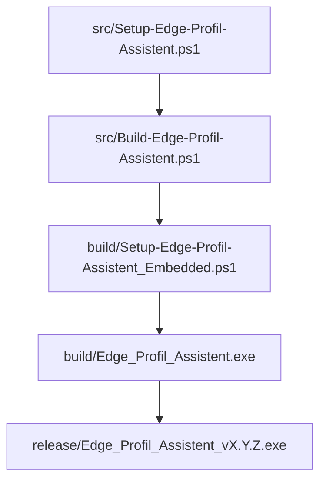

# DOKUMENTATION_TECHNIK

**Projekt:** Edge Profil-Assistent  
**Stand:** 21.06.2026

## 1. Architekturüberblick

Der Edge Profil-Assistent ist als **Single-EXE** auf Basis von PowerShell/WPF umgesetzt.

Hauptbestandteile:

- **Laufzeit-UI:** `src/Setup-Edge-Profil-Assistent.ps1`
- **Build-Orchestrierung:** `src/Build-Edge-Profil-Assistent.ps1`
- **Ressourcen:** `src/gorotech.png`, `src/gorotech.ico`, optionale Screenshots
- **Build-Ausgabe:** `build/`
- **Release-Ausgabe:** `release/`



## 2. Projektstruktur (relevant)

```text
Edge-Profil-Assistent/
├── src/
│   ├── Build-Edge-Profil-Assistent.ps1
│   ├── Setup-Edge-Profil-Assistent.ps1
│   ├── gorotech.png
│   ├── gorotech.ico
│   ├── screenshot_profil.png
│   └── version.txt
├── build/
├── release/
├── docs/
│   ├── DOKUMENTATION_ANWENDER.md
│   └── DOKUMENTATION_TECHNIK.md
├── README.md
└── _Archiv/
```

## 3. Laufzeitfluss der EXE

1. Embedded-Ressourcen werden nach `%LOCALAPPDATA%\Temp\EdgeSetupAssistent\run-<PID>` extrahiert.
2. Laufzeitkonfiguration (`Edge_Assistent.config.json`) wird im Runtime-Ordner erzeugt.
3. WPF-Fenster wird geladen und auf der linken Bildschirmhälfte positioniert.
4. Edge-Prozess wird bei Bedarf gestartet und rechts ausgerichtet.
5. Benutzer führt Schrittkette bis Abschluss aus.

### Ressourcen-Entpackung / Lock-Vermeidung

Zur Vermeidung von Dateisperren wird ein **pro Prozess eindeutiger Runtime-Ordner** verwendet (`run-<PID>`). Dadurch werden Kollisionen bei parallelen Instanzen reduziert.

## 4. Build-Prozess

Build-Kommando:

```powershell
powershell.exe -ExecutionPolicy Bypass -File .\src\Build-Edge-Profil-Assistent.ps1
```

Ablauf:

1. Eingabedateien aus `src/` prüfen
2. Embedded-Skript in `build/` erzeugen
3. Kompilierung via `Invoke-ps2exe`
4. EXE nach `build/Edge_Profil_Assistent.exe`
5. Versionierte EXE nach `release/Edge_Profil_Assistent_vX.Y.Z.exe` kopieren
6. Ältere Release-Dateien nach `release/_Archiv/` verschieben

## 5. Versionierung

`src/version.txt` ist die Standardquelle für die Version (Format `vX.Y.Z`).

Unterstützte Optionen:

- `-Version v1.2.3` (explizit)
- `-BumpPatch` (Patch +1)
- `-BumpMinor` (Minor +1, Patch=0)
- `-BumpMajor` (Major +1, Minor=0, Patch=0)

Regel: Es darf nur **ein** Bump-Schalter pro Lauf gesetzt werden.

## 6. Abhängigkeiten

- Windows PowerShell 5.1+ (oder kompatibel)
- Modul `ps2exe` (Import zur Buildzeit)
- Microsoft Edge auf Zielsystem (für geführte Schritte)

Die Build-Logik versucht bei fehlendem Modul eine Installation; in eingeschränkten Offline-Umgebungen sollte das Modul vorab bereitgestellt werden.

## 7. Logging und Diagnose

Das Build-Skript schreibt zeitgestempelte Logzeilen (`Write-Log`) für:

- Ressourcen-Einbettung
- Build-Erfolg/-Fehler
- Release-Kopie
- verwendete Version

Typische Fehlerbilder:

- **Dateisperre auf EXE**: laufenden Prozess `Edge_Profil_Assistent.exe` beenden
- **PS2EXE nicht verfügbar**: Modulimport/Installation prüfen
- **Fehlende Ressourcen**: Dateien in `src/` auf Vollständigkeit prüfen

## 8. Sicherheit und Randbedingungen

- Die Anwendung arbeitet im Benutzerkontext.
- Ressourcen werden in Benutzer-Tempverzeichnisse geschrieben.
- Es werden keine systemweiten Installationsschritte erzwungen.

## 9. Wartungsempfehlungen

- `src/version.txt` bei Releases bewusst pflegen.
- Vor Release immer Build + Starttest durchführen.
- `_Archiv/` als Altbestand beibehalten, aber nicht in aktive Pfade einbinden.

## 10. Weiterführende Dokumente

- `docs/DOKUMENTATION_ANWENDER.md`
- `README.md`
